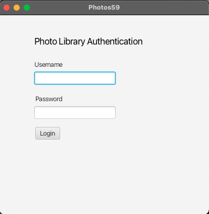
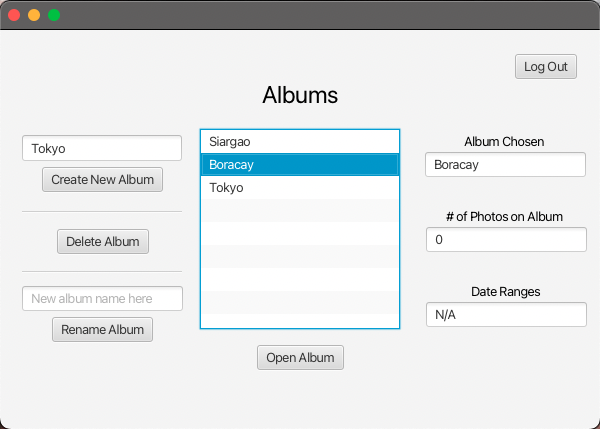
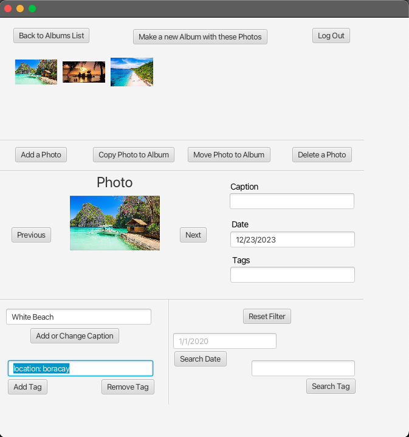

# Photo Library
Photo library is a desktop application built with JavaFX and FXML. This application allows user
to store photos in albums. Within the album, we provide features search as adding captions or tags to
the photos.

## Authentication View


Users must be added through the ```admin``` user account. The username is ```admin```
and password is ```admin```. 

## Admin View


Admins can add/delete/modify users on the application.

## Albums View


After a successful authentication, users are redirected to this page. Users can
create, delete, open or update albums here.

## Album View


Once the user opens an album, they can add photos to the albums. For every photo, the users
can add a caption or tags in the ```name: value``` format.  


## Authors
Rohan and Saman Sathenjeri
